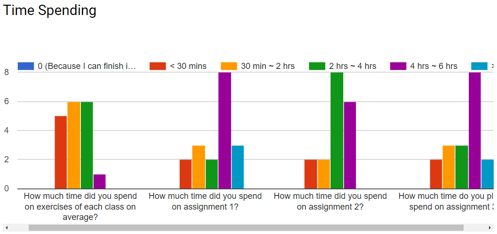
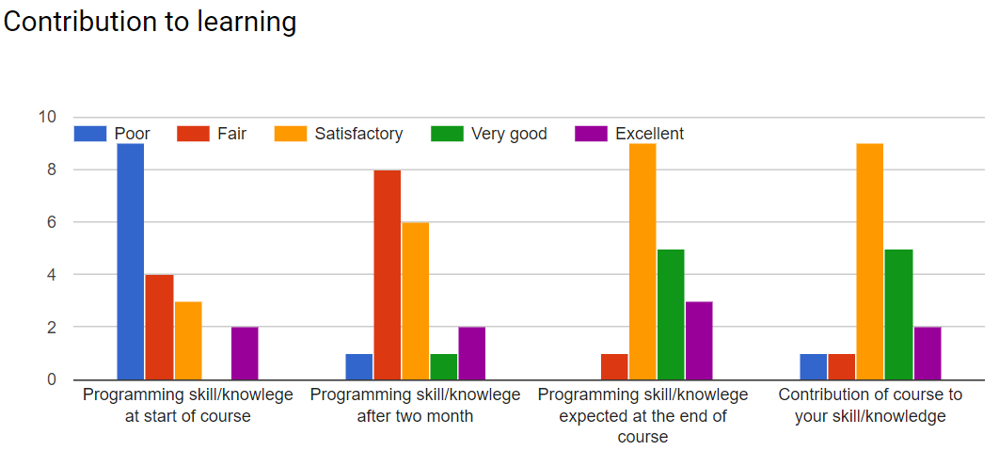

# First Month Feedback

## 1. Key stats:
### 1.1 How much time did you spend on exercises of each class onaverage?

### 1.2 Contribution to learning

### 1.3 others

## 2. What are three interesting/funny/cool things of taking this course?
- Python, more coding, cool professor
- making functions. making games. cool prof.
- open environment for questions; fun activities; hangman
- data analysis, solve problems, improve efficiency
- 1. You're a nice person 2. You encourage me to learn more. 3. I learn how to code from you although it's not very clear :(
- Really like Slack as a tool, Use of GitHub makes things easy, I like the casual atmosphere.
- Drawing with Turtle, creating games, activities useful for work
- Jude likes TV! There are a lot of interesting plugins, can do a lot with python
- You can do anything w/ Python.
- Prof. Jude is awesome, learning python makes me understand javascript better, being able to solve a requirement is the best feeling in the world
- relaxed, comfortable learning atmosphere/drawing with Turtle/learning Python syntax vs that of JS
- I found a lot of cool ways to make functions one line. The python challenge was fun. I found the idea of a tuple interesting
- learning code, how to solve problems, turtle
- I learn a skill that little to no other business students know, I have new more effective ways to solve problems, I like being able to work with teams on coding projects
- using python as a powerful math tool to solve problems, assignments are very interesting, I hope to use pygame to code a game
- The mutual of misunderstanding with other students, knowing you are not alone. The functions are super cool, being able to solve a problem is satisfying. Learning python itself is interesting and cool for the future.
- learning to code in python, learning important skills that classes generally don't teach, programming in general

## 3. How would you improve your skills in programming and benefit more from taking this course?
- Do more self- learning
- using it elsewhere like analytics or future jobs. 
- After I have gained this basis of Python, I intend to self-learn beyond what I have learned in the classroom. 
- Do more self-learning and research
- Take more courses online
- I wanted to get more exposure to programming (not specifically python language), to practice logic-thinking. So that I can more effectively communicate with developers. 
- Using information from this class and using it on outside projects for other classes or work
- maybe having a lot more  practice work on the side that is not way harder than what is done in class
- I wish we did more exercises in class and not outside, for they don't always make sense. 
- I've looked into taking online courses after I graduate. I'm also looking to go into tech consulting, so being able to understand programming is a huge benefit for me. 
- doing more independent projects, learning how to use python within web frameworks
- I think as a foundation course or just an introductory course to Python. This course offers everything you need to know to make a lot of cool applications.
- having the answers and then working backwards to understand how the code works, then having a similar problem and doing that problem from scratch
- If we would have time to try the exercises in class while professor or TA walked around would help us to practice skills and content while having our questions or problems answered. Then additional homework would help solidify understanding of the content
- more practice, more practice, and more practice
- I believe I need to start over and learn the basics. Also, do some programming on my own, for example the 100+ puzzles to solve. Possibly, come in with questions. I do not want to disturb the class so I would potentially go more to office hours. 
- I believe I will 

## 4. How would Professor Li improve this course?

- Be more clear in certain topics (explain the purpose too)
- less difficult exercises or go through them in class (?)
- He could help us understand the context of the different functions/topics we learn (how and where we would apply them)
- provide more interactive examples 
- 1. The gap between what you teach and the assignments/exercies given is TOO HUGE. Also, you can tell that many of the students are not engaged. I think it would be helpful if you make it more interactive.
- Assignments and quizzes are often way harder (complex) than what we cover in-class. It is discouraging (not only from a grading perspective) when you can't put your newly learned skill to a test cause the problem is so much harder than what you learned. 
- Slowing down a bit
- more easy practice problems.
- Not rush through functions as quickly. Also, go over how to use GitHub again.
- The difficulty gap between the inclass exercises and the homework should be smaller. Homeworks are very difficult compared to inclass exercises.
- greater emphasis on python as a data analytics tool
- He should consider sharing the code of other students to look at for reference or alternative solutions.
- more practice problems that are not necessarily mandatory/graded 
- Same as my last answer
- give us more time during the class to practice
- Learning certain functions during class and allowing the students to work on it on their own. Possibly, walk around and help the students work on the code instead of picking a name randomly and making the class time go longer. 
- offer supplemental materials for each class session (not required exercises but material that would help us learn)
- Provide some extra resources for students to  